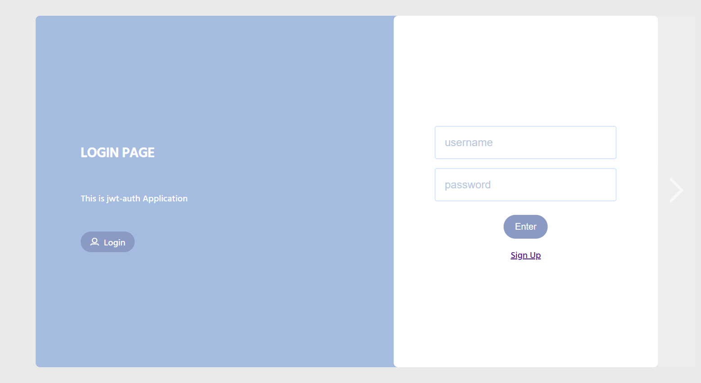
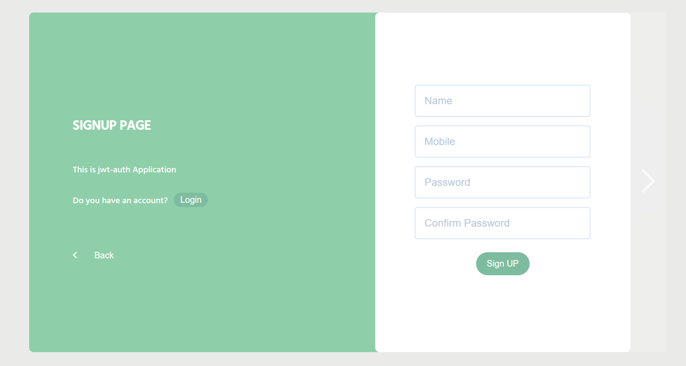

# 🚀 React Authentication App

Welcome to the **React Authentication App**! This project is designed to demonstrate seamless user authentication in a React application with beautifully animated sign-in and sign-up forms. It incorporates modern tools like JWT for authentication, Yup for form validation, and Axios for handling API requests, all with pure CSS animations to create an engaging user experience.

## ✨ Features

- **Fully Functional Authentication**: Users can sign up and log in using JWT authentication.
- **Smooth Animations**: Sign-in and sign-up forms come to life with stunning CSS animations.
- **Form Validation**: Input fields are validated using [Yup](https://github.com/jquense/yup) to ensure data integrity and security.
- **API Requests**: Interaction with backend APIs is handled with [Axios](https://axios-http.com/), supporting both GET and POST requests.
- **JWT Decoding**: User authentication state is managed using JWT, decoded with the help of [jwt-decode](https://www.npmjs.com/package/jwt-decode).

## 🛠 Installation

### Prerequisites

Make sure you have [Node.js](https://nodejs.org/) installed on your machine.

### Getting Started

1. Clone the repository from GitHub.
2. Navigate to the project folder.
3. Install the required dependencies.
4. Run the project locally.
5. Open your browser and visit `http://localhost:3000` to see your app in action!

## 🎨 How It Works

### 1. **Sign-Up Form**  
Users can create an account by providing their **username**, **email**, and **password**. The form input is validated using Yup, ensuring that all fields are correctly filled out.

### 2. **Sign-In Form**  
Once registered, users can log in using their credentials. Upon successful login, a JWT token is issued, and the user is authenticated.

### 3. **JWT Authentication**  
The JWT token is decoded using the [jwt-decode](https://www.npmjs.com/package/jwt-decode) package, allowing the app to manage and verify user sessions for secure API requests.

### 4. **API Requests with Axios**  
All requests to the API (sign-up, sign-in, etc.) are handled using [Axios](https://axios-http.com/), providing an easy and efficient way to send HTTP requests and receive responses.

## 🚀 Technologies Used

- **React** – The powerful JavaScript library for building user interfaces.
- **Axios** – Promise-based HTTP client for making API requests.
- **JWT** – JSON Web Tokens for user authentication.
- **Yup** – JavaScript schema validator for form input validation.
- **CSS** – Styling and animations (pure CSS, no external libraries).
- **React Router** – For handling navigation between pages.

## 📸 Screenshots

*Sign-In Form with smooth animations.*

*Sign-Up Form with animated transitions.*

## 💡 How to Contribute

Contributions are more than welcome! Here’s how you can help:

1. Fork the repository.
2. Create your branch.
3. Commit your changes.
4. Push to your branch.
5. Create a new pull request.

---

Feel free to **star** this repository and show your support. If you have any questions or suggestions, don’t hesitate to **open an issue** or **create a pull request**. Enjoy the app!

👨‍💻 **Happy coding!**
